# github-oidc-aws

[](https://github.com/WilliamSoaresCosta/github-oidc-aws/actions/workflows/ci.yml)

Módulo Terraform que cria a role para o GitHub Actions acessar a AWS por OIDC, sem access key
guardada em secret.

Fiz esse módulo depois de um AccessDenied que apareceu sem ninguém ter mexido na role. O GitHub
passou a mandar no token o ID numérico da organização e do repositório junto com o nome, e a
trust policy só conhecia o nome. Descobri olhando o evento no CloudTrail. Escrevi sobre isso aqui:
[O dia em que o OIDC quebrou sozinho](https://williamsoares.com/blog/oidc-quebrou-ids-imutaveis).

O módulo aceita os dois formatos.

<p align="center"></p>

## Uso

```hcl
module "github_oidc" {
  source = "github.com/WilliamSoaresCosta/github-oidc-aws?ref=v1.0.0"

  role_name     = "github-deploy-meu-site"
  github_org    = "minha-org"
  github_org_id = 12345678 # gh api orgs/minha-org --jq .id

  repositories = [{
    name = "meu-site"
    id   = 87654321 # gh api repos/minha-org/meu-site --jq .id
    refs = ["refs/heads/main"]
  }]
}
```

No workflow:

```yaml
permissions:
  id-token: write
  contents: read

steps:
  - uses: aws-actions/configure-aws-credentials@v4
    with:
      role-to-assume: ${{ vars.AWS_ROLE_ARN }}
      aws-region: us-east-1
```

Tem um exemplo completo com policy de deploy em S3 em [examples/basico](./examples/basico).

## Com ou sem IDs

Sem `github_org_id` e `id`, a role aceita:

```
repo:minha-org/meu-site:ref:refs/heads/main
```

Com os IDs:

```
repo:minha-org@12345678/meu-site@87654321:ref:refs/heads/main
```

Com ID é mais seguro: se alguém apagar o repositório e criar outro com o mesmo nome, o novo não
herda o acesso.

O output `subjects` mostra exatamente o que a role aceita. Se der AccessDenied, compare com o que
chegou no CloudTrail:

```bash
aws cloudtrail lookup-events \
  --lookup-attributes AttributeKey=EventName,AttributeValue=AssumeRoleWithWebIdentity \
  --max-results 5 --query 'Events[].CloudTrailEvent' --output text
```

## O que o módulo não deixa fazer

- usar curinga no nome do repositório (`minha-org/*`)
- liberar um repositório sem dizer de qual branch, tag ou environment
- duração de sessão fora de 15 min a 12 h

A comparação do `sub` é com `StringEquals`, não `StringLike`.

## Variáveis

| Nome | Descrição | Padrão |
|---|---|---|
| `role_name` | nome da role | - |
| `github_org` | dono dos repositórios | - |
| `github_org_id` | ID numérico do dono | `null` |
| `repositories` | lista de `{ name, id, refs, environments }` | - |
| `create_oidc_provider` | cria o provider OIDC (só existe um por conta) | `true` |
| `policy_arns` | policies gerenciadas | `[]` |
| `inline_policy_json` | policy inline | `null` |
| `max_session_duration` | duração da sessão em segundos | `3600` |
| `tags` | tags | `{}` |

Outputs: `role_arn`, `role_name`, `oidc_provider_arn`, `subjects`.

## Testes

```bash
terraform init -backend=false
terraform test
```

Usa provider mockado, então não cria nada na AWS. Testa os dois formatos e se o módulo recusa
curinga e repositório sem branch.
